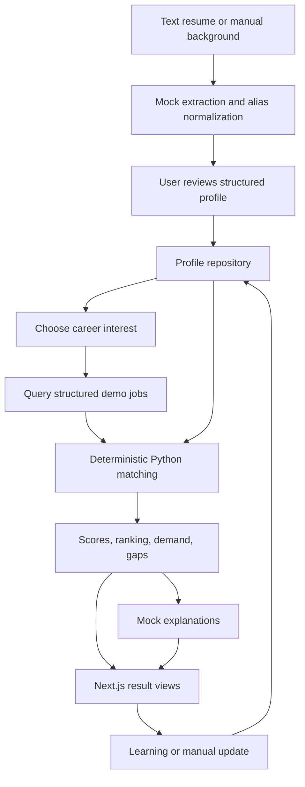

# Architecture

Profile first, career second. Numerical results come only from FastAPI's deterministic Python engine. The frontend displays API results; the AI provider explains computed facts.

| Layer | Responsibility |
| --- | --- |
| Next.js | Landing, forms, contextual views, navigation, loading/error states |
| Routes / Pydantic | Validate input; serialize output contracts; 404/415/422 errors |
| Services | Analysis aggregation, alternatives, learning, feedback loop |
| Repositories | Persistence and profile revisions |
| Matching | Pure deterministic scores, demand, priorities and ranking |
| AI | Known alias extraction and contextual explanations; no score authority |
| Database | Jobs, careers, requirements, profiles, saved jobs and progress |

Each demo clones Alex to a new UUID. The browser stores that ID; records persist in SQLite or PostgreSQL. Reload can reopen the profile and reanalyze a career. Edits increment the revision; results include profile/dataset versions. Scores are recalculated rather than cached.

Resume uploads are restricted to UTF-8 text and 1 MB. Files are read in memory and discarded. Known aliases become suggested Beginner skills for user review. Personal information, projects, education and experience are manually entered or explicitly loaded from the demo fixture.

Completion is idempotent per profile/resource. It raises proficiency to at least the learning outcome level, records progress, increments revision, and returns before/after analysis. This is clearly labeled simulated learning.

Pydantic output schemas generate OpenAPI and frontend response types. The generator models serialized defaults as present and is intended for response shapes, not as request-required-field policy.

The prototype runs one local API process. Production needs authentication/ownership enforcement, upload hardening, rate limits, coordinated migrations, and concurrent progress handling. No external service is required at runtime. Configured database errors remain visible rather than silently switching storage.
